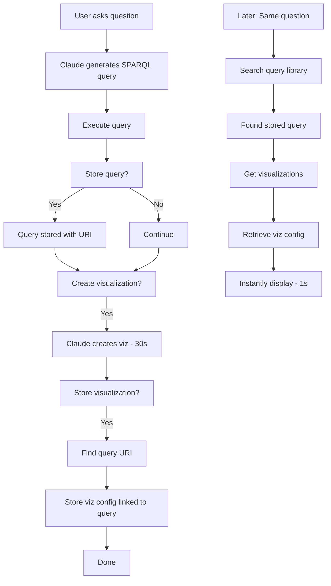

# Visualization Storage - Usage Guide

## Overview

Store visualizations alongside SPARQL queries in the query library. This allows Claude Desktop to instantly recreate visualizations without regenerating them, saving significant time.

## Version

- **Added in:** v0.4.0
- **New Tools:** `store_query_visualization`, `get_query_visualizations`
- **Total Tools:** 24

## How It Works

### The Problem
Creating visualizations (charts, graphs, network diagrams) from SPARQL query results can take 30+ seconds in Claude Desktop. Regenerating the same visualization repeatedly wastes time.

### The Solution
Store the visualization configuration in the query library linked to the query URI. Next time, Claude can instantly retrieve and recreate the visualization.

## Complete Workflow

### Step 1: Ask a Question
```
User: How many athletes won medals by country in the Olympics?
```

### Step 2: Claude Executes Query
Claude generates and runs a SPARQL query, returns results.

### Step 3: Store the Query
```
Claude: Would you like me to store this query in the library?
User: Yes
```

Query is stored with a URI like `query:query-1234567890`

### Step 4: Create Visualization
```
User: Create a bar chart showing this data
```

Claude creates a bar chart (takes 30+ seconds)

### Step 5: Store the Visualization
```
Claude: Would you like me to store this visualization?
User: Yes
```

**Behind the scenes:**
1. Claude calls `store_query_visualization`
2. Tool searches for query URI by title
3. Stores visualization config linked to that query URI

### Step 6: Instant Retrieval (Next Time)
```
User: Show me medal counts by country again
```

**Claude:**
1. Searches query library, finds the query
2. Calls `get_query_visualizations`
3. Retrieves stored visualization config
4. Instantly displays the chart (< 1 second!)

## Tool Details

### Tool 1: store_query_visualization

Stores a visualization configuration linked to a query.

**Parameters:**
- `queryTitle` (required): Title of the stored query
- `visualizationType` (required): Type of visualization
  - Options: `bar_chart`, `line_chart`, `pie_chart`, `scatter_plot`, `table`, `network_graph`, `timeline`, `heatmap`, `treemap`, `sankey`, `other`
- `visualizationConfig` (required): JSON string with the visualization configuration
- `description` (required): What the visualization shows
- `repository` (required): Repository name

**Example:**
```javascript
{
  queryTitle: "Medal counts by country",
  visualizationType: "bar_chart",
  visualizationConfig: '{"type":"bar","data":{"labels":["USA","China","Russia"],"datasets":[{"label":"Medals","data":[113,88,71]}]}}',
  description: "Bar chart showing total Olympic medals by country",
  repository: "olympics"
}
```

**What it does:**
1. Searches for the query URI matching the title
2. Creates a visualization URI like `viz:viz-1234567890`
3. Stores triples linking visualization to query:
   ```turtle
   viz:viz-1234567890 a viz:Visualization ;
       viz:forQuery query:query-1234567890 ;
       viz:type "bar_chart" ;
       viz:config "..." ;
       dc:description "..." .
   ```

### Tool 2: get_query_visualizations

Retrieves all stored visualizations for a query.

**Parameters:**
- `queryTitle` (required): Title of the query
- `repository` (optional): Repository name to filter by

**Returns:**
Array of visualizations with:
- `vizId`: Visualization URI
- `type`: Visualization type
- `config`: JSON configuration
- `description`: What it shows
- `created`: When it was created

**Example:**
```javascript
[
  {
    "vizId": "http://franz.com/ns/visualization#viz-1234567890",
    "type": "bar_chart",
    "config": "{\"type\":\"bar\",\"data\":{...}}",
    "description": "Bar chart showing total Olympic medals by country",
    "created": "2025-10-18T15:30:00Z"
  }
]
```

## Supported Visualization Types

### 1. **bar_chart**
- Best for: Comparing quantities across categories
- Example: Medal counts by country

### 2. **line_chart**
- Best for: Showing trends over time
- Example: Population growth over years

### 3. **pie_chart**
- Best for: Showing proportions of a whole
- Example: Distribution of sports in Olympics

### 4. **scatter_plot**
- Best for: Showing correlation between two variables
- Example: Age vs. medals won

### 5. **network_graph**
- Best for: Showing relationships/connections
- Example: Collaborations between authors

### 6. **timeline**
- Best for: Chronological events
- Example: Historical events in order

### 7. **heatmap**
- Best for: Intensity across two dimensions
- Example: Activity by hour and day of week

### 8. **treemap**
- Best for: Hierarchical data
- Example: Nested categories and sizes

### 9. **sankey**
- Best for: Flow diagrams
- Example: Medal flow from countries to sports

### 10. **table**
- Best for: Detailed data display
- Example: Complete results list

### 11. **other**
- For custom or specialized visualizations

## RDF Schema

The visualization storage uses this schema:

```turtle
@prefix viz: <http://franz.com/ns/visualization#> .
@prefix query: <http://franz.com/ns/query-library#> .
@prefix dc: <http://purl.org/dc/terms/> .

# Classes
viz:Visualization a rdfs:Class ;
    rdfs:comment "A visualization configuration for a SPARQL query" .

# Properties
viz:forQuery a rdf:Property ;
    rdfs:domain viz:Visualization ;
    rdfs:range query:StoredQuery ;
    rdfs:comment "Links a visualization to its query" .

viz:type a rdf:Property ;
    rdfs:domain viz:Visualization ;
    rdfs:range xsd:string ;
    rdfs:comment "Type of visualization (bar_chart, line_chart, etc.)" .

viz:config a rdf:Property ;
    rdfs:domain viz:Visualization ;
    rdfs:range xsd:string ;
    rdfs:comment "JSON configuration for the visualization" .
```

## Usage Examples

### Example 1: Store a Bar Chart

```
User: Create a bar chart of athlete counts by sport

[Claude creates query and bar chart]

Claude: Would you like me to store this visualization?
User: Yes

[Claude calls store_query_visualization with:]
- queryTitle: "Athlete counts by sport"
- visualizationType: "bar_chart"
- visualizationConfig: "{...chart.js config...}"
- description: "Bar chart showing number of athletes in each sport"
- repository: "olympics"

Result: ✅ Visualization stored successfully!
```

### Example 2: Retrieve and Recreate

```
User: Show me athlete counts by sport again

[Claude searches query library, finds the query]
[Claude calls get_query_visualizations]
[Claude retrieves the bar chart config]
[Claude instantly displays the chart using the stored config]

Time saved: 30+ seconds!
```

### Example 3: Multiple Visualizations for One Query

You can store multiple visualizations for the same query:

```
1. Store query: "Medal statistics"
2. Create and store bar chart: Total medals by country
3. Create and store pie chart: Percentage distribution
4. Create and store line chart: Medals over time

Next time:
User: Show me medal statistics
Claude: I found 3 visualizations for this query:
  1. Bar chart - Total medals by country
  2. Pie chart - Percentage distribution
  3. Line chart - Medals over time

Which would you like to see?
```

## Workflow Diagram



## Advanced Use Cases

### Use Case 1: Dashboard Queries
Store multiple related queries with visualizations for quick dashboard generation:

```
Queries:
- "Total sales by region" → Bar chart
- "Sales trend" → Line chart
- "Top products" → Table
- "Customer segments" → Pie chart

User: Show me the sales dashboard
→ Claude instantly loads all 4 visualizations
```

### Use Case 2: Report Generation
Store queries with table visualizations for recurring reports:

```
Query: "Monthly financial summary"
Visualization: Formatted table

User: Generate this month's financial report
→ Claude runs query with current data
→ Applies stored table formatting
→ Instant professional report
```

### Use Case 3: Network Analysis
Store complex network graph configurations:

```
Query: "Author collaboration network"
Visualization: D3 force-directed graph
Config: Node sizing, edge weights, colors, layouts

User: Show collaboration network
→ Instantly displays complex network graph
→ No 60-second regeneration wait
```

## Tips

### Tip 1: Descriptive Names
Use descriptive query titles for easier retrieval:
- ✅ "Medal counts by country in Summer Olympics"
- ❌ "Query 1"

### Tip 2: Store Multiple Variations
Store different visualization types for the same data:
- Bar chart for presentations
- Table for detailed analysis
- Export-friendly CSV format

### Tip 3: Update Visualizations
If you improve a visualization, store the new version. The old one remains for comparison.

### Tip 4: Document in Description
Use the description field to explain:
- What question does this answer?
- What's notable about this visualization?
- When to use this vs. other visualizations

Example:
```
"Bar chart showing medal counts by country, sorted descending.
Use this for presentations - clear and impactful.
For detailed analysis, use the table version instead."
```

## Troubleshooting

### Problem: "No stored query found"
**Solution:** Store the query first before storing the visualization.

### Problem: Multiple queries with same title
**Solution:** The tool will find the first matching query. Use unique, specific titles.

### Problem: Visualization config is too large
**Solution:** Store simplified config, or use "other" type with a reference to external file.

### Problem: Want to update a visualization
**Solution:** Store a new visualization. Both versions will be available via `get_query_visualizations`.

## Performance Benefits

| Action | Without Storage | With Storage | Time Saved |
|--------|-----------------|--------------|------------|
| Simple bar chart | 30 seconds | 1 second | 29 seconds |
| Complex network graph | 60 seconds | 1 second | 59 seconds |
| Dashboard (4 charts) | 120 seconds | 4 seconds | 116 seconds |
| Monthly report | 90 seconds | 2 seconds | 88 seconds |

## What Gets Stored

The visualization configuration typically includes:

**For Chart.js visualizations:**
```json
{
  "type": "bar",
  "data": {
    "labels": ["Category 1", "Category 2"],
    "datasets": [{
      "label": "Data Series",
      "data": [10, 20],
      "backgroundColor": "#3498db"
    }]
  },
  "options": {
    "responsive": true,
    "scales": {...}
  }
}
```

**For Mermaid diagrams:**
```
graph TD
  A[Start] --> B[Process]
  B --> C[End]
```

**For D3 visualizations:**
```json
{
  "nodes": [...],
  "links": [...],
  "layout": "force",
  "config": {...}
}
```

## Future Enhancements

Potential future features:
- Automatic visualization suggestions based on query results structure
- Visualization templates for common query patterns
- Interactive parameter updates (e.g., change date range without regenerating)
- Export visualizations to PNG, SVG, PDF

---

**Remember:** The visualization is linked to the query URI via SPARQL in the triple store, making it a true semantic web solution!
